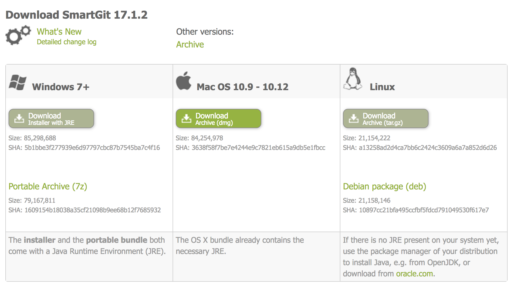
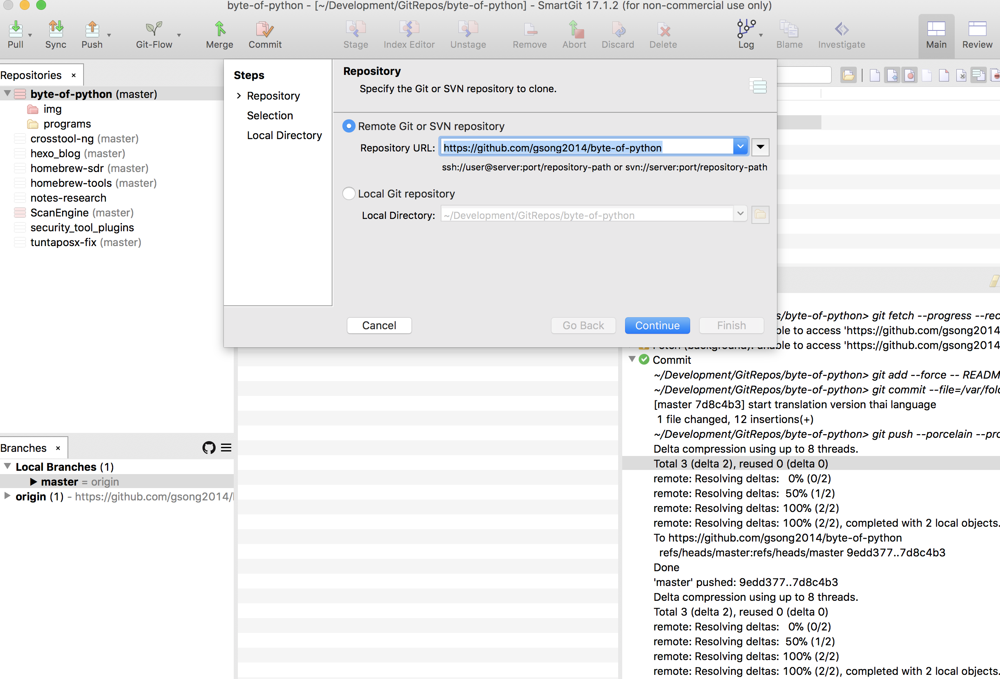
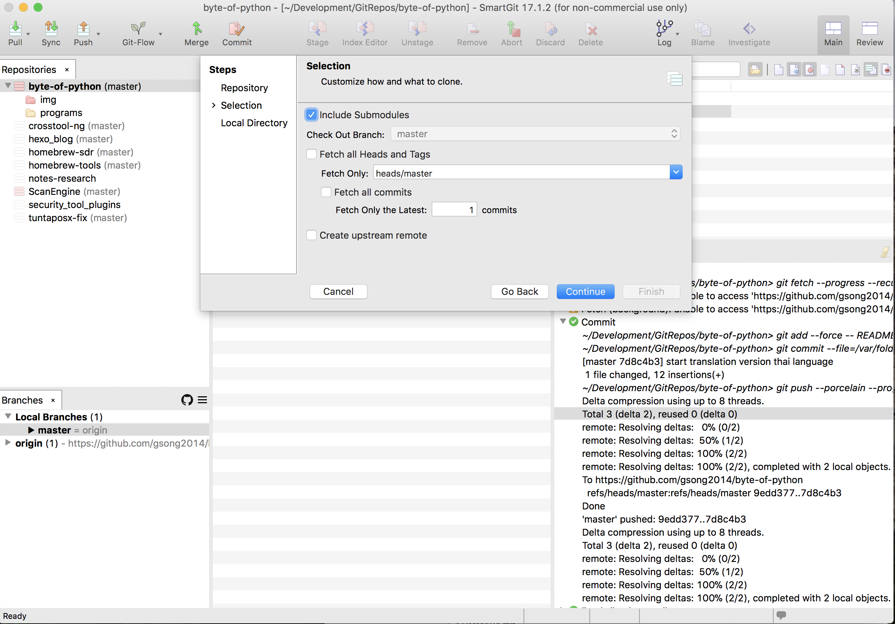
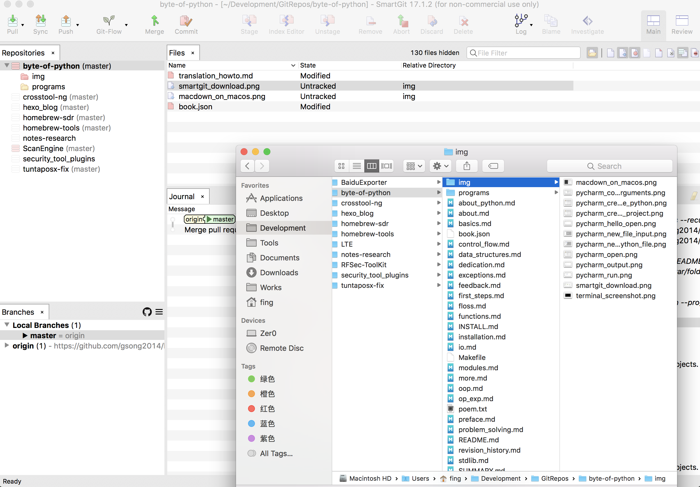
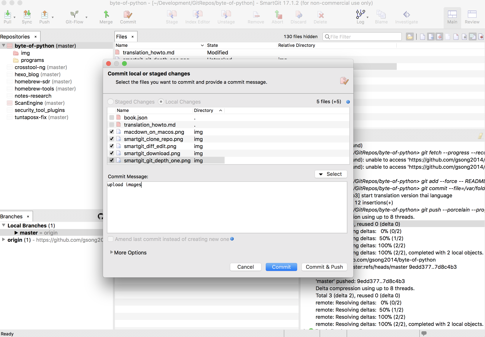

# วิธีการแปลหนังสือเล่มนี้ {#translation-howto}

1. สามารถดาวน์โหลดหนังสือต้นฉบับได้ที่ {{ book.sourceUrl }} หรือ สมัคร account github แล้วทำการ fork the repository.
2. วิธีการ [fork the repository](https://help.github.com/articles/fork-a-repo).
3. Then, fetch the repository to your computer. You need to know how to use [Git](http://www.git-scm.com) to do that.
4. Read the [GitBook documentation](https://help.gitbook.com), esp. the [Markdown section](https://help.gitbook.com/format/markdown.html).
5. Start editing the `.md` files to translate to your local language.
6. [Sign up on GitBook.com](https://www.gitbook.com), create a book and you can see a beautifully rendered website, with links to download PDF, EPUB, etc.

## วิธีการใช้ Git Desktop

เมื่อเราสมัคร account github แล้วเราจะต้อง [fetch the repository](https://help.github.com/articles/fetching-a-remote/) มาใน Local แล้วจะสามารถทำการแปลได้ และสามารถ [commit](https://help.github.com/articles/adding-a-file-to-a-repository-using-the-command-line/) หรือ เรียกว่า อัปเดตขี้น github ปกติสามารถใช้คำสั่ง `git` ทำได้ทั้งหมด แต่ในที่ผมขี้เกียจ ก็เลยใช้ Git Desktop Client แทน

ปกติผมใช้ [SmartGit](http://www.syntevo.com/smartgit) หรือแต่ก่อนใช้ [GitHub Desktop](https://desktop.github.com/) ในที่นี่ ผมจะใช้ SmartGit เป็นตัวอย่าง

สามารถดาวน์โหลด SmartGit ได้ที่ [http://www.syntevo.com/smartgit/download](http://www.syntevo.com/smartgit/download) :

เมื่อเราทำการดาวน์โหลด ติดตั้ง แลัวใช้ account github ล็อคอินใน SmartGit เสร็จ แล้วทำการ [fetch the repository](https://help.github.com/articles/fetching-a-remote/) ไปที่ `Repository->Clone`:

เลือกเฉพาะ tag master ก็พอ มีค่าเท่ากับ `git clone https://github.com/gsong2014/byte-of-python --depth=1 `:

เมื่อมีการแก้ไขหรือเพิ่ม ใน smartgit จะแสดงส่วนแตกต่างจากเดิม :

ตอนนี้เราสามารถ commit ได้แล้ว ด้วยกดปุ่ม `Commit` เลือกไฟล์ที่จะ update แล้วกดปุ่ม `Commit & Push`:

